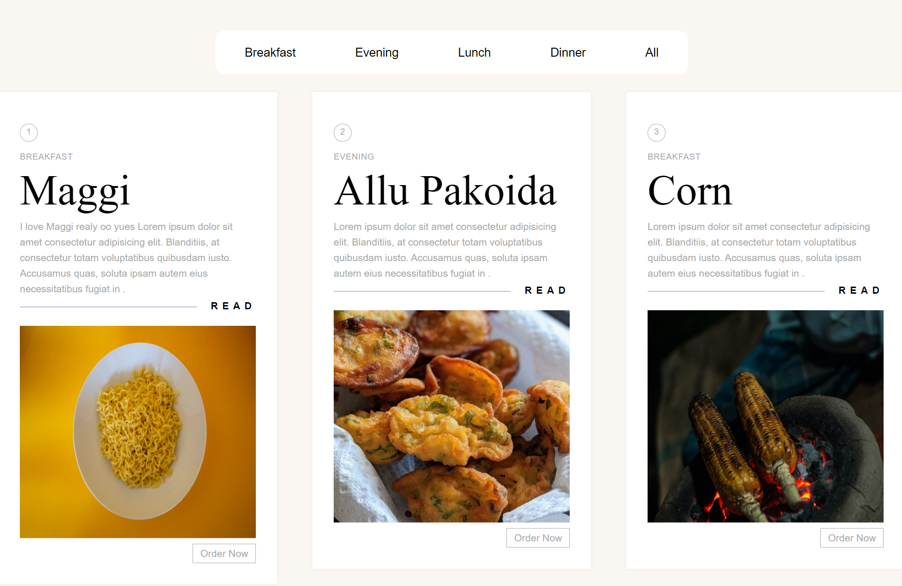

# Responsive Landing Page

Welcome to the Responsive Landing Page project! This is a web development project built with HTML, CSS, React, and JavaScript, aimed at creating a visually appealing and responsive landing page for a website or product.

## Table of Contents
- [Demo](#demo)
- [Features](#features)
- [Technologies Used](#technologies-used)
- [Getting Started](#getting-started)
- [Usage](#usage)

## Demo

You can check out a live demo of the project [https://foodgardens.netlify.app/](https://foodgardens.netlify.app/).

## Features

- **Responsive Design**: The landing page is designed to be fully responsive, ensuring a great user experience across various devices and screen sizes.

- **Modern UI**: The project incorporates modern design principles to create an attractive and engaging user interface.

- **Interactive Elements**: Interactive features are added using JavaScript to enhance user engagement.

- **Easy Customization**: The codebase is structured for easy customization, allowing you to adapt the landing page for your specific needs.

## Technologies Used

- HTML5: Used for structuring the web page.
- CSS3: Used for styling and layout.
- React: Used for building reusable UI components.
- JavaScript: Used for adding interactivity and functionality to the landing page.

## Getting Started

To get started with this project, follow these steps:

1. Clone the repository to your local machine:

   ```bash
   git clone https://github.com/yourusername/responsive-landing-page.git

2. Navigate to the project directory:
   
   ```bash
   cd responsive-landing-page

3. Install dependencies:

   ```bash
   npm install
   
4. Start the development server:

   ```bash
   npm start

5. Open your web browser and visit http://localhost:3000 to view the landing page.

## Usage

You can use this landing page for your website or product by customizing the content, styles, and images.
To customize the landing page, you can modify the HTML, CSS, and React components as needed. 
The project structure is designed to make customization straightforward.
